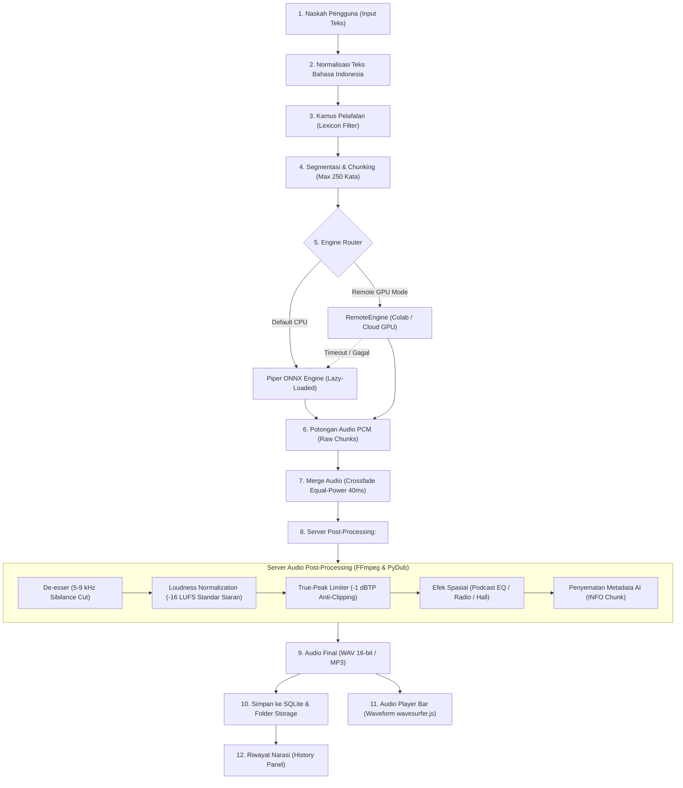

# Dokumen Arsitektur Sistem: TaSTP (Platform TTS Self-Hosted)

**Platform Text-to-Speech Mandiri Bergaya ElevenLabs / Google AI Studio**
*Fokus Niche: Kreator Konten & Video Narasi (YouTube, TikTok, Reels, Podcast)*
*Target Hardware: Laptop Intel Iris (CPU-Only, Tanpa CUDA GPU, RAM 4–16 GB)*

---

## 1. Diagram Alur Data (Text-to-Audio Pipeline)

Alur pemrosesan dirancang modular dari naskah teks mentah hingga audio siap putar di browser, memastikan performa ringan tanpa membebani memori CPU laptop.



### Penjelasan Tahapan Alur Data:
1. **Input Teks:** Pengguna memasukkan naskah di editor tengah (maks. 5.000 karakter).
2. **Normalisasi Indonesia:** Mengonversi angka formal/kasual (`Rp 50.000` → *lima puluh ribu rupiah*, `17/08/1945` → *tujuh belas Agustus seribu sembilan ratus empat puluh lima*, `45 km/jam`, `28°C`, persentase, singkatan umum `PT, BUMN`).
3. **Lexicon Filter:** Mengganti kata khusus/asing sesuai kamus pelafalan kustom pengguna.
4. **Segmentasi & Chunking:** Memecah naskah panjang ke dalam chunk klausa alami (maks. 250 kata per chunk) agar inferensi ONNX tidak mengunci core CPU laptop terlalu lama.
5. **Engine Router:** Mengarahkan sintesis ke **Piper ONNX** (lokal CPU) atau **RemoteEngine** (Colab GPU). Jika Remote GPU offline atau lambat (>5 detik), sistem otomatis *fallback* ke Piper.
6. **Sintesis Audio:** Inferensi per chunk menghasilkan array data PCM 22.05kHz 16-bit.
7. **Merge & Crossfade:** Penggabungan tiap potongan menggunakan kurva *equal-power* 40ms untuk menghilangkan letupan (*clicks/pops*) pada sambungan kalimat.
8. **Server Post-Processing:** Pemrosesan audio terpusat di backend:
   - De-esser untuk meredam frekuensi desis tajam (5–9 kHz).
   - Normalisasi Loudness **-16 LUFS** (ITU-R BS.1770) + True-Peak Limiter (-1 dBTP) untuk standar YouTube/Podcast.
   - Efek opsional: *Podcast Warm EQ*, *Transmisi Radio/HT*, *Gema Aula (Hall)*.
   - Penyematan metadata etika AI (`ICMT`: *"Dibuat dengan AI - TaSTP Studio"*).
9. **Player & History:** Audio dikirim ke frontend untuk visualisasi waveform instan dan disimpan ke riwayat SQLite.

---

## 2. Struktur Folder Lengkap & Fungsi Tiap Modul

```
d:/web_teks-to-speak/
├─ docker-compose.yml              # Orkestrasi Docker untuk frontend dan backend
├─ start_dev.bat                   # Skrip satu-klik peluncur lokal dev Windows
├─ README.md                       # Dokumentasi utama proyek
├─ docs/                           # Dokumentasi teknis
│  ├─ PROJECT.md                   # Spesifikasi kebutuhan & batasan hardware
│  └─ ARCHITECTURE.md              # Rencana arsitektur sistem (dokumen ini)
│
├─ backend/                        # Layanan Backend Python (FastAPI)
│  ├─ Dockerfile                   # Docker build container backend + FFmpeg
│  ├─ requirements.txt             # Dependensi Python (fastapi, piper-tts, pydub, aiosqlite)
│  ├─ storage/                     # Folder persistensi lokal (dikecualikan dari Git)
│  │  ├─ tastp.db                  # Database SQLite lokal
│  │  ├─ models/                   # File model ONNX (.onnx) dan konfigurasi (.json)
│  │  └─ audio/                    # File output audio sementara & permanen
│  └─ app/
│     ├─ main.py                   # Entrypoint FastAPI, lifecycle startup/shutdown, CORS
│     ├─ config.py                 # Konfigurasi aplikasi, env, guardrail hardware Intel Iris
│     ├─ database.py               # Session SQLAlchemy async (aiosqlite)
│     ├─ models/
│     │  └─ schema.py              # Definisi tabel DB (SQLAlchemy) & Pydantic DTO
│     ├─ engines/                  # Lapisan Engine TTS
│     │  ├─ __init__.py
│     │  ├─ base.py                # Interface tunggal TTSEngine (Abstract Base Class)
│     │  ├─ piper_engine.py        # Adapter Piper ONNX CPU-only (Lazy-loading model)
│     │  ├─ remote_engine.py       # Adapter Remote Colab/Kaggle GPU + auto-fallback
│     │  └─ f5tts_engine.py        # Adapter F5-TTS (opsional/remote only)
│     ├─ text/                     # Pemrosesan Naskah
│     │  ├─ __init__.py
│     │  ├─ normalize.py           # Normalisasi angka, rupiah, tanggal, singkatan Indonesia
│     │  ├─ splitter.py            # Pemecah kalimat cerdas berbasis tanda baca & jeda
│     │  └─ lexicon.py             # Kamus koreksi pelafalan kata pengguna
│     ├─ emotion/                  # Pengaturan Ekspresi
│     │  ├─ __init__.py
│     │  ├─ mapper.py              # Konversi intensitas emosi ke laju (rate) & pitch
│     │  └─ prosody.py             # Variasi mikro-intonasi agar tidak terdengar robotik
│     ├─ audio/                    # Utilitas Audio
│     │  ├─ __init__.py
│     │  ├─ processor.py           # Merge chunk, crossfade 40ms, format konverter WAV/MP3
│     │  ├─ loudness.py            # Normalisasi -16 LUFS (ITU-R BS.1770) + True-Peak limiter
│     │  ├─ effects.py             # Efek audio server (Podcast Warm EQ, Radio HT, Hall)
│     │  └─ watermark.py           # Penyematan metadata AI "Dibuat dengan AI"
│     ├─ voices/                   # Manajemen Suara
│     │  ├─ __init__.py
│     │  ├─ registry.py            # Katalog suara default & pemindaian model lokal
│     │  └─ catalog.json           # Metadata suara bawaan kreator (Gadis, Bima, Siti, Dimas)
│     ├─ queue/                    # Antrean Job Sintesis
│     │  ├─ __init__.py
│     │  └─ manager.py             # Job queue FIFO asinkron hemat memori
│     └─ api/                      # Routing REST API
│        ├─ __init__.py
│        ├─ router.py              # Router utama FastAPI
│        └─ endpoints/             # Endpoint per modul (health, tts, voices, projects)
│
└─ frontend/                       # Antarmuka Pengguna Studio (Next.js 14)
   ├─ Dockerfile                   # Docker build frontend
   ├─ package.json                 # Dependensi Next.js, Tailwind, Zustand, wavesurfer.js
   ├─ next.config.mjs              # Konfigurasi Next.js & API proxy rewrite
   ├─ tailwind.config.ts           # Token tema gelap studio (Slate, Matte Card, Amber Accent)
   ├─ tsconfig.json                # Pengaturan TypeScript ketat
   └─ src/
      ├─ app/
      │  ├─ layout.tsx             # Root layout HTML, font Inter, tema gelap default
      │  ├─ page.tsx               # Halaman studio utama (layout 3 kolom)
      │  └─ globals.css            # Utilitas CSS ringan (tanpa backdrop-filter blur berat)
      ├─ components/
      │  ├─ layout/
      │  │  └─ Sidebar.tsx         # Kolom 1: Navigasi menu & status dev hardware
      │  ├─ editor/
      │  │  ├─ EditorSection.tsx   # Kolom 2: Area teks naskah narasi
      │  │  ├─ Toolbar.tsx         # Tombol Paste, Clear, Undo, dan Quick Prompts
      │  │  └─ CounterBar.tsx      # Penghitung karakter, kata, dan estimasi durasi baca
      │  ├─ controls/
      │  │  ├─ ControlPanel.tsx    # Kolom 3: Panel pengaturan suara & efek
      │  │  ├─ EngineSelector.tsx  # Pemilih engine Piper ONNX vs Remote GPU
      │  │  ├─ VoicePicker.tsx     # Kartu pilihan karakter suara kreator
      │  │  ├─ SliderControl.tsx   # Slider kecepatan (0.5x–2.0x) dan tinggi nada
      │  │  └─ ConsentBox.tsx      # Checkbox persetujuan etika kloning suara
      │  ├─ player/
      │  │  ├─ AudioPlayerBar.tsx  # Bar pemutar audio sticky di bagian bawah editor
      │  │  └─ WaveformView.tsx    # Visualisasi gelombang audio ringan (wavesurfer.js)
      │  └─ history/
      │     └─ HistoryList.tsx     # Riwayat pembuatan audio lokal
      ├─ store/
      │  └─ ttsStore.ts            # State management global (Zustand)
      └─ lib/
         └─ api.ts                 # HTTP client fetch ke endpoint backend
```

---

## 3. Desain Interface `TTSEngine` (Abstract Base Class)

Seluruh engine TTS (Piper ONNX, Remote Colab/Kaggle, atau F5-TTS) wajib mengimplementasikan interface tunggal berikut:

```python
from abc import ABC, abstractmethod
from pathlib import Path
from typing import List, Dict, Any, Optional
from pydantic import BaseModel

class SynthesisParams(BaseModel):
    text: str
    voice_id: str
    speed: float = 1.0          # Rentang: 0.5 s.d. 2.0
    pitch: float = 0.0          # Rentang: -5.0 s.d. +5.0
    audio_effect: str = "none"  # "none", "podcast_eq", "radio", "hall"
    extra_params: Optional[Dict[str, Any]] = None

class SynthesisResult(BaseModel):
    audio_path: Path
    duration_sec: float
    sample_rate: int
    engine_name: str
    is_fallback_used: bool = False

class VoiceMetadata(BaseModel):
    id: str
    name: str
    gender: str                 # "male" | "female"
    language: str               # "id-ID"
    category: str               # "creator" | "narrator" | "podcast" | "news"
    description: str
    sample_rate: int = 22050
    is_cloned: bool = False

class TTSEngine(ABC):
    """
    Interface tunggal untuk semua engine sintesis suara di TaSTP.
    Menjamin arsitektur decoupled dan kemudahan pergantian engine.
    """

    def __init__(self, name: str):
        self.name = name
        self._loaded_models: Dict[str, Any] = {}

    @abstractmethod
    def is_available(self) -> bool:
        """
        Mengecek apakah engine siap digunakan (file ONNX ada / server remote aktif).
        Output: True jika engine dapat menerima tugas sintesis.
        """
        pass

    @abstractmethod
    async def load_model(self, voice_id: str) -> None:
        """
        Memuat model suara ke RAM secara lazy-load ketika suara tersebut dipanggil.
        Tidak boleh memuat model saat startup aplikasi.
        """
        pass

    @abstractmethod
    async def unload_model(self, voice_id: str) -> None:
        """
        Melepaskan model dari memori RAM setelah idle untuk menghemat RAM Intel Iris.
        """
        pass

    @abstractmethod
    async def synthesize(
        self,
        params: SynthesisParams,
        output_file: Path
    ) -> SynthesisResult:
        """
        Melakukan inferensi audio dari teks yang telah dinormalisasi.
        Input: SynthesisParams dan Path tujuan penyimpanan file WAV.
        Output: SynthesisResult berisi path file, durasi detik, dan status fallback.
        """
        pass

    @abstractmethod
    def get_supported_voices(self) -> List[VoiceMetadata]:
        """
        Mengembalikan daftar suara yang didukung oleh engine ini.
        Output: List objek VoiceMetadata.
        """
        pass
```

---

## 4. Skema Database (SQLite / SQLAlchemy)

Database SQLite (`tastp.db`) mengelola data lokal persistensi tanpa membutuhkan server database eksternal:

### Tabel 1: `voices`
Menyimpan katalog suara bawaan dan model klon suara yang diimpor pengguna.
```sql
CREATE TABLE voices (
    id VARCHAR(64) PRIMARY KEY,
    name VARCHAR(100) NOT NULL,
    gender VARCHAR(20) NOT NULL DEFAULT 'female',   -- 'male' / 'female'
    language VARCHAR(20) NOT NULL DEFAULT 'id-ID',
    category VARCHAR(50) NOT NULL DEFAULT 'creator', -- 'creator', 'narrator', 'podcast', 'news'
    description VARCHAR(255) DEFAULT '',
    engine VARCHAR(32) NOT NULL DEFAULT 'piper',    -- 'piper' / 'remote'
    model_path VARCHAR(255) NOT NULL,
    config_path VARCHAR(255),
    sample_rate INTEGER NOT NULL DEFAULT 22050,
    is_cloned BOOLEAN NOT NULL DEFAULT 0,
    created_at TIMESTAMP DEFAULT CURRENT_TIMESTAMP
);
```

### Tabel 2: `jobs`
Melacak status eksekusi antrean sintesis audio (asinkron).
```sql
CREATE TABLE jobs (
    id VARCHAR(64) PRIMARY KEY,
    text TEXT NOT NULL,
    voice_id VARCHAR(64) NOT NULL,
    engine_name VARCHAR(32) NOT NULL DEFAULT 'piper',
    speed REAL NOT NULL DEFAULT 1.0,
    pitch REAL NOT NULL DEFAULT 0.0,
    status VARCHAR(20) NOT NULL DEFAULT 'queued',   -- 'queued', 'processing', 'completed', 'failed'
    audio_path VARCHAR(255),
    duration_sec REAL DEFAULT 0.0,
    error_message TEXT,
    is_cloned BOOLEAN DEFAULT 0,
    has_consent BOOLEAN DEFAULT 0,                  -- Wajib 1 jika is_cloned = 1
    created_at TIMESTAMP DEFAULT CURRENT_TIMESTAMP,
    completed_at TIMESTAMP,
    FOREIGN KEY (voice_id) REFERENCES voices(id)
);
```

### Tabel 3: `history`
Menyimpan rekaman riwayat narasi yang selesai digenerate untuk diputar ulang atau diunduh kembali.
```sql
CREATE TABLE history (
    id VARCHAR(64) PRIMARY KEY,
    job_id VARCHAR(64) NOT NULL,
    project_id VARCHAR(64),
    title VARCHAR(150) NOT NULL,
    preview_text VARCHAR(255) NOT NULL,
    audio_url VARCHAR(255) NOT NULL,
    duration_sec REAL NOT NULL DEFAULT 0.0,
    voice_name VARCHAR(100) NOT NULL,
    created_at TIMESTAMP DEFAULT CURRENT_TIMESTAMP,
    FOREIGN KEY (job_id) REFERENCES jobs(id),
    FOREIGN KEY (project_id) REFERENCES projects(id)
);
```

### Tabel 4: `lexicon`
Kamus koreksi pelafalan kata untuk istilah asing, bahasa gaul, atau singkatan khusus.
```sql
CREATE TABLE lexicon (
    id VARCHAR(64) PRIMARY KEY,
    word VARCHAR(100) NOT NULL UNIQUE,             -- Kata sumber (mis. 'YouTube')
    replacement VARCHAR(150) NOT NULL,             -- Cara baca (mis. 'yu-tyub')
    voice_id VARCHAR(64),                          -- Opsional (NULL = berlaku semua suara)
    is_regex BOOLEAN NOT NULL DEFAULT 0,
    created_at TIMESTAMP DEFAULT CURRENT_TIMESTAMP
);
```

### Tabel 5: `projects`
Menyimpan draf naskah naskah video/podcast pengguna yang sedang dikerjakan.
```sql
CREATE TABLE projects (
    id VARCHAR(64) PRIMARY KEY,
    title VARCHAR(150) NOT NULL DEFAULT 'Naskah Baru',
    description VARCHAR(255),
    script_content TEXT NOT NULL,
    voice_id VARCHAR(64),
    created_at TIMESTAMP DEFAULT CURRENT_TIMESTAMP,
    updated_at TIMESTAMP DEFAULT CURRENT_TIMESTAMP
);
```

---

## 5. Daftar Endpoint REST API & Contoh Request / Response

Seluruh endpoint melayani protokol HTTP JSON standar di `http://127.0.0.1:8000/api`:

### 1. `GET /api/health`
Mengecek status sistem, resource hardware Intel Iris, dan ketersediaan engine.
- **Request:** `GET /api/health`
- **Response Contoh (200 OK):**
```json
{
  "status": "ok",
  "app_name": "TaSTP - Self-Hosted TTS",
  "version": "1.0.0",
  "hardware": {
    "mode": "cpu_only",
    "target": "Intel Iris / CPU",
    "max_threads": 4,
    "cuda_enabled": false
  },
  "default_engine": "piper",
  "remote_available": false,
  "ai_disclosure_enabled": true,
  "timestamp": "2026-10-07T10:15:30Z"
}
```

### 2. `GET /api/voices`
Mengambil daftar suara kreator yang tersedia di server.
- **Request:** `GET /api/voices`
- **Response Contoh (200 OK):**
```json
[
  {
    "id": "piper_id_gadis_fast",
    "name": "Gadis - Kreator Energik",
    "gender": "female",
    "language": "id-ID",
    "category": "creator",
    "description": "Suara wanita muda ceria & ekspresif, pas untuk video pendek TikTok & Reels.",
    "engine": "piper",
    "sample_rate": 22050,
    "is_cloned": false
  },
  {
    "id": "piper_id_bima_narrator",
    "name": "Bima - Narator Hangat",
    "gender": "male",
    "language": "id-ID",
    "category": "narrator",
    "description": "Vokal pria tenang, berwibawa, cocok untuk narasi dokumenter & YouTube video essay.",
    "engine": "piper",
    "sample_rate": 22050,
    "is_cloned": false
  }
]
```

### 3. `POST /api/synthesize`
Membuat permintaan sintesis suara baru. Menerapkan validasi etika voice clone.
- **Request Contoh:**
```json
{
  "text": "Stop scroll dulu! Tahu nggak kenapa 90 persen kreator gagal monetisasi di bulan pertama? Ini dia 3 rahasia algoritma!",
  "voice_id": "piper_id_gadis_fast",
  "speed": 1.05,
  "pitch": 0.0,
  "audio_effect": "podcast_eq",
  "is_cloned_voice": false,
  "voice_clone_consent": false
}
```
- **Response Contoh (200 OK):**
```json
{
  "job_id": "job_a7b9c3e1f042",
  "status": "completed",
  "audio_url": "/api/audio/job_a7b9c3e1f042",
  "duration_sec": 6.8,
  "engine_used": "piper",
  "created_at": "2026-10-07T10:16:00Z",
  "message": "Permintaan berhasil diproses."
}
```

### 4. `GET /api/jobs/{job_id}`
Memantau progres sintesis jika diproses secara latar belakang.
- **Request:** `GET /api/jobs/job_a7b9c3e1f042`
- **Response Contoh (200 OK):**
```json
{
  "id": "job_a7b9c3e1f042",
  "status": "completed",
  "audio_url": "/api/audio/job_a7b9c3e1f042",
  "duration_sec": 6.8,
  "error_message": null,
  "created_at": "2026-10-07T10:16:00Z"
}
```

### 5. `GET /api/audio/{job_id}`
Mengambil aliran data audio hasil sintesis (disertai header etika AI).
- **Request:** `GET /api/audio/job_a7b9c3e1f042`
- **Response Headers:**
  - `Content-Type: audio/wav`
  - `X-Generated-By: TaSTP-AI`
  - `X-AI-Disclosure: Dibuat dengan AI - TaSTP Studio`
- **Response Body:** Data biner file WAV 16-bit.

---

## 6. Daftar Risiko Teknis di Laptop Intel Iris & Solusi Teruji

| No | Risiko Teknis | Dampak pada Sistem | Solusi Arsitektural yang Diterapkan |
|---|---|---|---|
| **1** | **Out-Of-Memory (OOM) pada RAM 4–8 GB** | Laptop *freeze* / crash jika model PyTorch berat (F5-TTS/Bark) dimuat ke memori. | **1. Engine Default ONNX:** Menggunakan Piper ONNX runtime yang sangat hemat memori (~80–150 MB RAM per suara).<br>**2. Lazy-Loading:** Model hanya dimuat ke RAM saat pertama kali tombol generate ditekan.<br>**3. Model Eviction:** Memori model di-unload otomatis jika tidak digunakan selama 15 menit. |
| **2** | **CPU Throttling & Suhu Panas Laptop** | Performa laptop menurun drastis saat memproses teks panjang secara bersamaan. | **1. Smart Chunking:** Naskah dipecah menjadi chunk maksimal 250 kata, diproses bertahap dengan jeda event loop.<br>**2. Pembatasan Thread:** Membatasi `OMP_NUM_THREADS = 4` agar sistem operasi dan antarmuka tetap responsif.<br>**3. FIFO Queue:** Mencegah inferensi paralel yang menumpuk di CPU. |
| **3** | **UI Browser Lag / Patah-patah** | Rendering waveform canvas panjang dan efek CSS blur membebani GPU bawaan Intel Iris. | **1. No Heavy Blur:** Tidak menggunakan `backdrop-filter: blur(20px)` atau glassmorphism berat di Tailwind.<br>**2. Bounded Waveform:** Resolusi sample `wavesurfer.js` dibatasi (max 512 titik per detik).<br>**3. Server Audio Rendering:** Seluruh efek audio (EQ, Reverb) diproses di server via FFmpeg, bukan di Web Audio API browser. |
| **4** | **Ketidakstabilan Koneksi Remote GPU (Colab/Kaggle)** | User mengalami error *timeout* saat Colab terputus atau sesi habis. | **1. Auto Fallback:** `RemoteEngine` memiliki batas *timeout* 10 detik. Jika gagal, otomatis dialihkan ke Piper ONNX lokal tanpa memunculkan error fatal.<br>**2. UI Notification:** Terdapat indikator badge *"Mode Fallback: Suara dihasilkan Piper lokal"* pada player. |
| **5** | **Penumpukan File Audio Sampah di Disk** | Disk laptop dev cepat penuh akibat ratusan file audio uji coba. | **1. SQLite Metadata Index:** Semua audio terindeks rapi di tabel `history`.<br>**2. Auto Cleanup Job:** Menjalankan background cleaner otomatis yang menghapus file audio temporer yang tidak disimpan ke proyek setelah 7 hari. |
